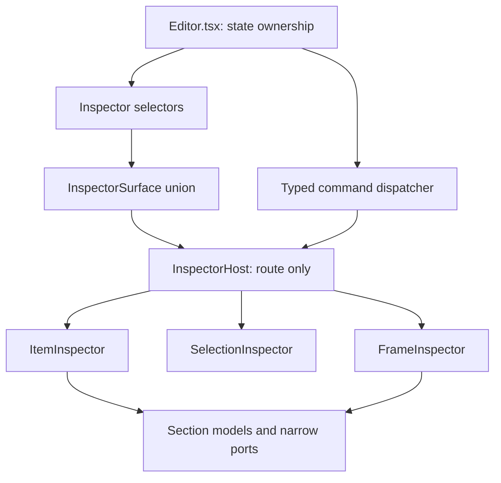

# Inspector契約設計: Editor Rootからread modelとtyped commandへ

## 位置付け

これはInspectorの責務を再分解する設計ではない。Inspectorの責務分解は既存コメントの設計を維持し、その契約を実装へ反映したPR2の記録である。

今回定義するのは、`Editor.tsx`がInspectorへ何を公開し、Inspectorがどのように編集命令を返すかという境界である。目的は、`Doc`全体、`Partial<Item>`、booleanとoptional callbackの組み合わせをInspectorへ渡さないことにある。

以下の`diff`は、実装前後の契約差分を説明するための設計記録である。PR2ではこの契約を互換adapterなしで実装した。

## 現在の契約

現在の`Editor.tsx`は、選択対象を解決したうえで次のような広い契約を組み立てている。

```diff
- <Inspector
-   ai={{ ready, reason, busy, onRun, onCancel }}
-   item={selectedIds.length > 1 ? null : selected}
-   railStandalone={isStandalone}
-   frame={selectedPartFrame}
-   palette={p}
-   frames={frame === "phone" ? frames : []}
-   onChange={patchSelected}
-   onDelete={deleteSelected}
-   onDuplicate={duplicateSelected}
-   onAlign={alignSelected}
-   multi={selectedIds.length}
-   grouped={!!selectedGroup}
-   onGroup={groupSelected}
-   onUngroup={ungroupSelected}
- />
+ <InspectorHost model={inspectorModel} dispatch={dispatchInspector} />
```

`FrameInspector`も同じ問題を持つ。

```diff
- <FrameInspector
-   frame={selectedFrame}
-   frames={frames}
-   prompt={buildPrompt(doc, widths, selectedFrame.id, lang)}
-   onChange={(patch) => patchFrame(selectedFrame.id, patch)}
-   onSaveImage={() => saveFrameImage(selectedFrame)}
-   onTidy={() => tidy(selectedFrame)}
-   onPlace={(place) => setPlace(selectedFrame, place)}
-   onSize={(preset) => setFramePreset(selectedFrame.id, preset)}
-   ...
- />
+ <InspectorHost model={inspectorModel} dispatch={dispatchInspector} />
```

現状の問題は、Inspectorが単にpropsを多く受け取ることではない。以下の責務が同じ契約に押し込まれている。

| 現在の入力 | 問題 |
| --- | --- |
| `item: Item \| null` | 未選択・複数選択・単一Itemをnullと個数から再判定する |
| `multi`、`grouped`、`railStandalone` | 相互排他的な表示ルートをbooleanで表している |
| `frames: Frame[]` | Navigation編集に必要な候補だけでなく、Document全体を渡している |
| `onChange: Partial<Item>` | patchの意味、不変条件、履歴単位がInspector境界へ漏れる |
| `frame: Frame`、`Partial<Frame>` | Frameの保存モデルとInspectorの表示モデルが同一になっている |
| `ai.ready`、`ai.busy`、`ai.reason` | 不可能な組み合わせを型が防がない |
| `onSaveImage` | exportのpending/errorとDocumentの保存状態が混同されやすい |

## 目標の依存関係



責務の所有者は次のようにする。

| 責務 | 所有者 | Inspectorへ公開する形 |
| --- | --- | --- |
| Document、履歴、不変条件 | `Editor.tsx`内のDocument command層 | typed commandの実装 |
| 選択対象の解決 | selector | `InspectorSurface`のvariant |
| 編集可能領域の判定 | selector / capability builder | section modelの存在・variant |
| セクションの表示 | Inspector section | 狭いread model |
| 編集命令の発行 | section | 狭いtyped command |
| picker、file input、copy feedback | 対応するleaf component | ローカルUI state |
| AI、exportの非同期処理 | Editor側のworkflow | union statusとcommand |

InspectorはDocumentの所有者にならない。Documentを直接変更せず、Editorが公開するcommandを発行するだけにする。

## 提案する公開モデル

### Routeをdiscriminated unionにする

`null`、`multi`、`grouped`、`railStandalone`の組み合わせを廃止し、Inspectorが表示するルートを一つのvariantで表す。

```diff
- type InspectorProps = {
-   item: Item | null;
-   multi: number;
-   grouped?: boolean;
-   railStandalone?: boolean;
-   onGroup?: () => void;
-   onUngroup?: () => void;
-   onAlign?: (kind: AlignKind) => void;
- };
+ type InspectorSurface =
+   | { kind: "empty"; reason: "no-selection" }
+   | {
+       kind: "selection";
+       model:
+         | { kind: "many"; count: number; groupAction: "group" }
+         | { kind: "group"; count: number; groupAction: "ungroup" };
+     }
+   | {
+       kind: "item";
+       model: ItemInspectorModel;
+     }
+   | {
+       kind: "frame";
+       model: FrameInspectorModel;
+     };
```

`groupAction`を`canGroup`と`canUngroup`の二つのbooleanにしない。`many`と`group`を別variantにすることで、表示される操作をselectorの結果で決める。

### Itemのread model

Item全体を渡すのではなく、既存の責務分解に対応したsection modelを作る。sectionが存在しないことはboolean propではなく、そのItemがその編集領域を持たないことを表す。

```diff
- type ItemInspectorModel = {
-   item: Item;
-   frame?: Frame | null;
-   frames: Frame[];
-   railStandalone: boolean;
-   ai: AiHooks;
- };
+ type ItemInspectorModel = {
+   id: string;
+   kind: Kind;
+   header: ItemHeaderModel;
+   frame: ItemFrameContext | null;
+   sections: {
+     text?: ItemTextModel;
+     tabs?: TabsModel;
+     media?: MediaModel;
+     icons?: IconModel;
+     style?: StyleModel;
+     state?: StateModel;
+     rail?: RailModel;
+     geometry?: GeometryModel;
+     navigation?: NavigationModel;
+     behavior?: BehaviorModel;
+   };
+ };
+
+ type ItemFrameContext = {
+   id: string;
+   width: number;
+   height: number;
+   kind: "phone" | "desktop";
+ };
```

例えばNavigation編集に必要なのは、全`Frame`ではなく、選択可能な遷移先の一覧である。

```diff
- frames: Frame[];
+ type NavigationModel = {
+   slots: readonly {
+     key: string;
+     label: string;
+     action: NavigationAction | null;
+   }[];
+   targets: readonly {
+     id: string;
+     label: string;
+   }[];
+ };
```

### Frameのread model

Frameの保存形式をそのまま公開せず、Inspectorの領域単位で必要な値だけを公開する。

```diff
- type FrameInspectorProps = {
-   frame: Frame;
-   frames: Frame[];
-   prompt: string;
-   tidy: TidyState;
-   ai: AiHooks;
- };
+ type FrameInspectorModel = {
+   id: string;
+   header: FrameHeaderModel;
+   identity: FrameIdentityModel;
+   appearance: FrameAppearanceModel;
+   layout: FrameLayoutModel;
+   navigation: FrameNavigationModel;
+   export: FrameExportModel;
+ };
+
+ type FrameExportModel = {
+   prompt: string;
+   image: ExportStatus;
+ };
```

PNG exportの`image`は、Documentが保存されたことを表さない。ローカルで画像生成・ダウンロードが完了したかどうかだけを表す。

```diff
- type ExportStatus = { saving: boolean };
+ type ExportStatus =
+   | { kind: "idle" }
+   | { kind: "running" }
+   | { kind: "error"; message: string };
```

成功状態をDocumentへ書き込まず、成功時だけ一時的なfeedbackを表示する。保存先からのacknowledgementがない静的な画像ダウンロードに、成功を先取りする`useOptimistic`は追加しない。

## Typed commandの境界

`Partial<Item>`と`Partial<Frame>`は廃止する。ただし、Inspectorから発行するすべての操作を一つの巨大な`EditorCommand`へまとめるのも避ける。routeとsectionごとにcommandを狭め、Editor側でDocument commandへ変換する。

```diff
- type ItemChange = (patch: Partial<Item>) => void;
- type FrameChange = (patch: Partial<Frame>) => void;
+ type ItemCommand =
+   | { kind: "set-label"; value: string }
+   | { kind: "set-supporting"; value: string }
+   | { kind: "set-variant"; value: Variant }
+   | { kind: "set-icon"; slot: string; value: string | null }
+   | { kind: "set-tab-count"; value: number }
+   | { kind: "set-navigation"; slot: string; value: NavigationAction | null }
+   | { kind: "set-size"; value: number | undefined }
+   | { kind: "set-corner-radius"; side: CornerSide; value: number };
+
+ type FrameCommand =
+   | { kind: "set-name"; value: string }
+   | { kind: "set-description"; value: string }
+   | { kind: "set-background"; value: ColorToken | undefined }
+   | { kind: "set-place"; value: Place }
+   | { kind: "set-size"; value: FramePreset }
+   | { kind: "set-swipe"; direction: SwipeDir; target: string | null }
+   | { kind: "tidy" }
+   | { kind: "duplicate" }
+   | { kind: "delete" }
+   | { kind: "preview" }
+   | { kind: "export-image" };
+
+ type SelectionCommand =
+   | { kind: "group" }
+   | { kind: "ungroup" }
+   | { kind: "align"; value: AlignKind }
+   | { kind: "duplicate" }
+   | { kind: "delete" };
```

routeを越えて命令を渡す場合だけ、外側に対象variantを付ける。

```diff
- onChange(patch);
+ dispatch({
+   target: "item",
+   id: model.id,
+   command: { kind: "set-label", value },
+ });
```

Editor側のdispatcherは次の責務を持つ。

1. 対象IDが現在のDocumentに存在するか確認する
2. ロックや不変条件を確認する
3. 必要なら履歴snapshotを作る
4. Document commandを適用する
5. 重い再計算だけを`startTransition`へ入れる

Inspector sectionはsnapshot、`setGroups`、`setFrames`、`frameOfGroup`を知らない。

## Sectionへの公開

`ItemInspector`はsectionの順序と表示だけを組み立て、各leafへ全Itemや全commandを渡さない。

```diff
- <ItemInspector item={item} onChange={patchSelected} ... />
+ <ItemInspector model={surface.model} dispatch={itemDispatch} />
+
+ // ItemInspector内部
+ <ItemHeader model={model.header} dispatch={headerDispatch} />
+ {model.sections.text && (
+   <ItemTextSection model={model.sections.text} dispatch={textDispatch} />
+ )}
+ {model.sections.icons && (
+   <IconSection model={model.sections.icons} dispatch={iconDispatch} />
+ )}
+ {model.sections.navigation && (
+   <NavigationSection model={model.sections.navigation} dispatch={navigationDispatch} />
+ )}
```

`itemDispatch`をそのままleafへ渡さず、sectionごとのdispatcherを作る。これにより、Text sectionから`delete`や`set-swipe`を発行できない。

## AIの状態

`ready`、`busy`、`reason`を個別のboolean/optional値で渡さず、状態と操作可能性をunionにする。

```diff
- type AiHooks = {
-   ready: boolean;
-   reason?: string;
-   busy: boolean;
-   onRun: () => void;
-   onCancel: () => void;
- };
+ type AiCapability =
+   | { kind: "unavailable"; reason: string }
+   | { kind: "ready"; run(): void }
+   | { kind: "running"; cancel(): void };
```

AIリクエスト本体、`AbortController`、`useActionState`、`startTransition`はEditor側のworkflowが所有する。`BehaviorSection`は、状態を表示して`run`または`cancel`を呼ぶだけにする。

## ローカルUI stateの所有

すべての`useState`や`useRef`をEditorへ移すわけではない。Documentに属さない一時状態は、それを必要とするleafに残す。

| 現在のstate/ref | 移行先 | 理由 |
| --- | --- | --- |
| `fileRef` | `ImageSourceEditor` | DOM file inputの所有者を一つにする |
| `slotKey`、`pickerOpen` | `IconSection` / `IconSlotPicker` | icon slotの一時選択でありDocumentではない |
| `actionSlot` | `NavigationSection` | 表示中のslot選択であり保存モデルではない |
| `onTab` | `ToggleAppearanceSection` | 通常状態とon状態の編集対象を選ぶUI状態 |
| `copied` | `PromptPreview` | clipboard feedbackだけに必要 |
| export pending | `ImageExportAction` | PNG生成の非同期状態だけに必要 |

逆に、選択ID、Frame/Itemの値、履歴、ロック判定、Document patchの解釈はEditor側に残す。

## React Asyncとの接続

この契約でAsync Reactを適用する場所を限定する。

| 操作 | 適用 | 理由 |
| --- | --- | --- |
| 通常のText/Style編集 | command内で必要な場合だけ`startTransition` | Document再計算が重い場合に限る |
| AI生成 | `useActionState`またはworkflow action + `AbortController` | pending/error/cancelがある非同期処理 |
| PNGダウンロード | pending/error状態 | 静的ダウンロードに保存結果を捏造しない |
| Clipboard copy | local feedback state | Action化するほどの非同期workflowではない |
| Optimistic Document更新 | 現時点では追加しない | 永続先のacknowledgementとrollback対象がない |

## PR2での実装結果

1. `lib/inspector-contract.ts`に`InspectorSurface`、section read model、typed commandを実装した。
2. `Editor.tsx`はselectorとdispatcherを所有し、InspectorへDocumentやpatch callbackを渡さないようにした。
3. `InspectorHost`はsurfaceのdiscriminated unionだけでrouteを分岐する。
4. FrameはHeader、Identity、Appearance、Navigation、Exportへ、ItemはText、Tabs、Media、Icon、Style、State、Rail、Geometry、Navigation、Behaviorへ分割した。
5. `MobileInspector`も同じItem read modelと`ItemCommand`を使う。
6. 公開propsから`Partial<Item>`、`Partial<Frame>`、`multi`、`grouped`、`railStandalone`、AIのboolean組み合わせを削除した。
7. PNG exportはDocumentの保存成功を表さず、running/errorだけをsurfaceへ公開する。acknowledgementのない操作へ`useOptimistic`は追加していない。
8. `pnpm typecheck`、`pnpm test -- --runInBand`（20 files / 668 tests）、`pnpm build`を通過した。

このPRでは互換adapterや旧propsのフォールバックを残していない。この設計でInspectorの責務を再定義するのではなく、既に合意した責務分解を、Editorの所有モデルと矛盾しない契約へ接続した。
